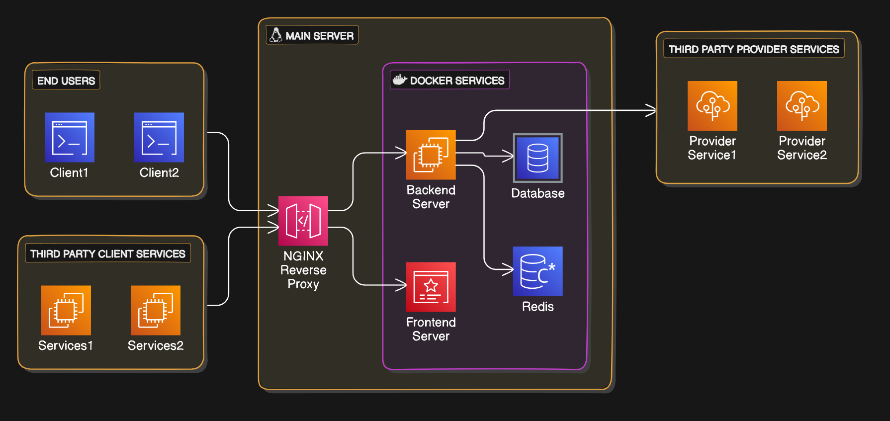

# Detailed Design Document

## Introduction

This Detailed Design Document for **XYZ system** built by **XYZ company** provides a complete description of the system.

### Problem Definition

The project aims to solve **XYZ problem**. _Briefly explain the problem and how the final product will help solve the problem._

### Purpose

_Briefly explain the purpose of the document._

### Scope and objectives

The scope of this document is to provide information about the design procedure of the system. The design constraints, data design, architectural design, security design, user interface design, testing strategies, documentation guidelines, and deployment and implementation plans will be elucidated in the scope of this document. Also chosen helper libraries and complete time planning of the system will be included. The intended audience is the ones who will implement the project, hence it is aimed that this document to be a guideline for those developers.

### Overview

_Briefly explain what each sections of the document contains in different paragraphs._

### Definitions, Acronyms, and Abbreviations

Definitions, acronyms and abbreviations are listed in the below table.

|     |                          |
| --- | ------------------------ |
| DDD | Detailed Design Document |
| UI  | User Interface           |
| ERD | Entity Relation Diagram  |
| TS  | TypeScript               |
| OTP | One Time Password        |

## Data Design

### Data model

The system utilizes a relational data model to organize and manage its data. The data model consists of several tables, each representing a specific entity or concept within the system. Relationships between tables are established using keys, including primary keys and foreign keys.

#### Entity Relation Diagram

The following entities are represented in the ERD:

1. **User**: Stores information about the user, including user ID, first name, last name, email, contact, and password.
2. **UserRefreshToken**: Contains data related to the user's session, such as refresh token, expiry date of the token, and the user's ID.
3. **UserValidationOTP**: Contains OTP code associated with the user, during email or contact verification process, it includes attributes like the OTP code, expiry date of the code, and user's ID.
4. **VehicleManufacturer**: Represents individual vehicle manufacturing companies, with attributes like manufacturer ID and name.
5. **VehicleType**: Represents vehicle types, with attributes like type ID and type name.
6. **Vehicle**: Represents individual vehicles, with attributes such as vehicle ID, manufacturer ID, type ID, license plate number and availability.
7. **Employee**: Represents individual employees of the company, with attributes such as employee ID, first name, last name, contact number, email, join date and active status.
8. **PaymentSource**: Contains details of different payment sources, including source ID, and name.
9. **PaymentStatus**: Represents payment status like Success, Failed and others, it includes attributes like status ID and status name.
10. **Payment**: Stores information related to the payment transaction associated with vehicle contract, it includes attributes like payment ID, amount, discount percentage, final amount, transaction reference code, source ID, transaction date, completion date, employee remark, and status ID.
11. **UserVehicleContract**: Represents the user's vehicle contract, it includes attributes like contract ID, user's ID, vehicle's ID, contract date, end date of the contract, payment ID, and contract creator's _(employee)_ ID.

#### Table Definition

The following tables are part of the relational data model:

1. **User**:
   |Column Name|Properties|
   |---|---|
   | id | Primary Key, INT |
   |firstName |VARCHAR(255)|
   |lastName| VARCHAR(255)|
   |email| VARCHAR(255)|
   |isEmailValid| BOOLEAN|
   |contact| VARCHAR(255)|
   |isContactValid| BOOLEAN|
   |password| VARCHAR(255)|

1. **UserRefreshToken**:
   |Column Name|Properties|
   |---|---|
   | token | Composite Key, VARCHAR(255) |
   |userId| Composite Key, Foreign Key referencing User, INT|
   |expiresOn |DateTime|

1. **UserValidationOTP**:
   |Column Name|Properties|
   |---|---|
   | otp | Composite Key, VARCHAR(255) |
   |userId| Composite Key, Foreign Key referencing User, INT|
   |expiresOn |DateTime|

1. **VehicleManufacturer**:
   |Column Name|Properties|
   |---|---|
   | id | Primary Key, INT |
   |name| VARCHAR(255)|

1. **VehicleType**:
   |Column Name|Properties|
   |---|---|
   | id | Primary Key, INT |
   |name| VARCHAR(255)|

1. **Vehicle**:
   |Column Name|Properties|
   |---|---|
   |id| Primary Key, INT|
   |manufacturerId| Foreign Key referncing VehicleManufacturer, INT|
   |licencePlateNumber|VARCHAR(255)|
   |isAvailiable| BOOLEAN|
   |typeId| Foreign Key referncing VehicleType, INT|

2. **Employee**:
   |Column Name|Properties|
   |---|---|
   | id | Primary Key, INT |
   |firstName |VARCHAR(255)|
   |lastName| VARCHAR(255)|
   |email| VARCHAR(255)|
   |contact| VARCHAR(255)|
   |isActive| BOOLEAN|
   |joinDate| Date|

3. **PaymentSource**:
   |Column Name|Properties|
   |---|---|
   | id | Primary Key, INT |
   |name| VARCHAR(225)|

4. **PaymentStatus**:
   |Column Name|Properties|
   |---|---|
   | id | Primary Key, INT |
   |name| VARCHAR(225)|

5. **Payment**:
   |Column Name|Properties|
   |---|---|
   | id | Primary Key, INT |
   |amount |MONEY|
   |discount| DOUBLE|
   |finalAmount| MONEY|
   |transactionRef| VARCHAR(255)|
   |sourceId| Foreign Key referncing PaymentSource, INT|
   |transactionDate|DateTime|
   |completionDate|DateTime|
   |remark|LONGTEXT|
   |statusId| Foreign Key referncing PaymentStatus, INT|

6. **UserVehicleContract**:
   |Column Name|Properties|
   |---|---|
   | id | Primary Key, INT |
   |userId| Foreign Key referncing User, INT|
   |vehicleId| Foreign Key referncing Vehicle, INT|
   |contractDate|DateTime|
   |contractEndDate|DateTime|
   |paymentId| Foreign Key referncing Payment, INT|
   |contractBy| Foreign Key referncing Employee, INT|

The relational data model facilitates efficient storage, retrieval, and manipulation of data within the system. Relationships between entities are maintained through foreign key constraints, ensuring data integrity and consistency.

## System Architecture

### High-Level System Architecture
The system architecture follows a monolithic architecture pattern, where all components of the application are containerized using Docker. The architecture consists of the following high-level components:

1. **User Interface (UI) Layer**: Responsible for presenting the user interface and handling user interactions. It includes the frontend components of the application built using React.
2. **Backend Application**: Contains the application logic, business rules, and data processing functionalities. It includes server-side code written in Node.js using Nest.js framework.
3. **Data Storage Layer**: Manages the persistence and retrieval of data.
   1. It includes a relational database system (e.g., MariaDB/PostgreSQL) for storing structured data.
   2. And Redis as an in-memory data store for caching frequently accessed data. It improves performance by reducing database load and latency.
4. **Proxy Layer**: Acts as a reverse proxy and load balancer, directing incoming requests to the appropriate services. It improves security, performance, and scalability by offloading SSL termination, caching, and request routing.

### Component interaction diagrams

### Technology stack and Framework Used

## Detailed Component Design

## User Interface Design

## Security Design

## Integration and Interface Design

## Deployment and Implementation Plan

## Testing Strategy

## Documentation Guidelines

## Glossary
